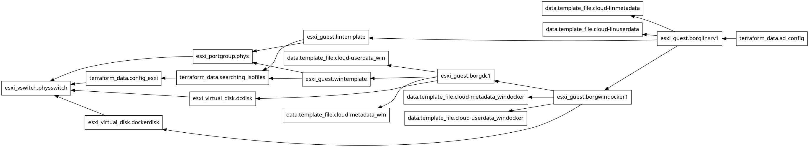

# Automated Install of a small Windows AD environment from scratch

## Computers

  * Windows AD Domain Controller - deployed from [borgWinTemplate](../borgwin_template/README.md)
  * Windows Server (Domain Member) with Docker and Windows Admin Center - deployed from [borgWinTemplate](../borgwin_template/README.md)
  * Debian/GNU Linux Server (Domain Member) to use as gateway for AD - deployed from [borgLinTemplate](../borglin_template/generiso.sh)

## Features

  * Even the deployment of the Template VMs are automated
  * [AD](https://en.wikipedia.org/wiki/Active_Directory) Domain Controller
  * AD integrated [DNS](https://en.wikipedia.org/wiki/Domain_Name_System) Server
  * AD integrated [DHCP](https://en.wikipedia.org/wiki/Dynamic_Host_Configuration_Protocol) Server with a configured Scope
  * [Windows Admin Center](https://www.microsoft.com/en-us/windows-server/windows-admin-center)
  * [Docker CE (Windows version)](https://github.com/microsoft/Windows-Containers/tree/Main/helpful_tools/Install-DockerCE) to use nano server containers
  * Disabled IPv6
  * Disabled NetBIOS over TCP (on Windows servers)

## Resource Topology

### Example AD config

  * Enable AD Recycle bin
  * Create `Servers` OU for the two Domain Member servers

## Requirements

  * [ESXi](https://www.vmware.com/products/cloud-infrastructure/esxi-and-esx) Host - 7.0+ for Windows 2022 Guest - with configured storage [subsystem](../iscsi_target/README.md)
  * [Terraform](https://www.terraform.io/) admin [client](../terraform_cli_vm/README.md)
  * Assimilated [Debian/GNU Linux](https://www.debian.org/) 12 installer - for example borglin.iso
  * Assimilated [Windows Server 2022](https://www.microsoft.com/en-US/windows-server) installer - for example borg_win2k22.iso

## Usage

  * `terraform apply` :-) . If you are brave then with "--auto-approve" ;-)

## Terraform files

### Unavailable objects

**This repo is only a so-called demo version so some folders/files are not available.**

  * 000_*_template_files  : special files, scripts, etc. for borgLinTemplate and borgWinTemplate guests
  * 000_config_esxi_files : special admin scripts for ESXi Host
  * borg_linsrv_files     : special scripts for Debian/GNU Linux Domain Member Server
  * inputfiles            : secrets, sshkeys, etc...

### Variables

  * [000_var_sys.tf](000_var_sys.tf)           : static variables for ESXi host
  * [000_var_template.tf](000_var_template.tf) : static variables for Template VMs
  * [var_physnet.tf](var_physnet.tf)           : static variables for the physical network
  * [var_borgdc1.tf](var_borgdc1.tf)           : static variables for the AD Forest and the AD Domain Controller
  * [var_borglinsrv1.tf](var_borglinsrv1.tf)   : static variables for the Debian GNU/LINUX domain member server
  * [var_windocker1.tf](var_windocker1.tf)     : static variables for the Windows domain member Server
  * [000_locals.tf](000_locals.tf)             : dynamic (computed) variables for all objects

#### Sensitive variables

  * Password for ESXi host
  * Nameserver on the physical network

### Provider files

  * [000_esxi.tf](000_esxi.tf)                 : ESXi provider settings
  * [versions.tf](versions.tf)                 : install [josenk ESXI provider](https://github.com/josenk/terraform-provider-esxi)

### Resources in the installation order

 1. [000_borg_network.tf](000_borg_network.tf)                                                         : Install a new vswitch with portgroup for the VMs
 2. [000_config_esxi.tf](000_config_esxi.tf), [001_datadisks.tf](001_datadisks.tf)                     : Configure the ESXi host and create extra datadisks for the guestVMs
 3. [000_isoimages.tf](000_isoimages.tf)                                                               : Simple delaying tool until the iso files will be arrived in the ESXi Datastore
 4. [000_borgLinTemplate.tf](000_borgLinTemplate.tf), [000_borgWinTemplate.tf](000_borgWinTemplate.tf) : Deploy the Template VMs
 5. [001_borgdc.tf](001_borgdc.tf) with [borgdc_files](borgdc_files)                                   : Deploy the AD Forest with one Domain Controller
 6. [002_borgadmdocker.tf](002_borgadmdocker.tf) with [borgadmdckr_files](borgadmdckr_files)           : Deploy the Windows Server with Admin Center and join it to the AD
 7. [002_borglinsrv1.tf](002_borglinsrv1.tf)                                                           : Deploy the Debian/GNU Linux server
 8. [003_adconfig_example.tf](003_adconfig_example.tf) with [scriptfiles](003_adconfig_example_files)  : Join the Linux server to the AD, install docker on the Windows Server and do some config on the Domain Controller.

## Video files of the install

### Part 1 - Deploying the templates

> [!NOTE]
> The esxi_virtual_disk.dcdisk file is not needed to create the template

| title                                                                                                                | startpos (hh:mm)| endpos (hh:mm)| length (min)|
|----------------------------------------------------------------------------------------------------------------------|-----------------|--------------|-------------|
| [Check the ESXI environment and create ISO files](https://youtu.be/7Oe1Mn3Vb3oI)                                     | 00:00           | 00:14        | 14          |
| [Create templates from ISO files](https://youtu.be/DpMM03b9Trw)                                                      | 00:14           | 00:27        | 13          |
| [Prepare Windows Server Template...](https://youtu.be/ckC0AhoefPs)                                                   | 00:27           | 00:32        | 05          |
| [...Complete Windows Server Template](https://youtu.be/NmXQihEiryA)                                                  | 01:00           | 01:17        | 17          |

### Part 2 - Deploying the guestVMs

| title                                                                                                                 | startpos (hh:mm)| endpos (hh:mm)| length (min)|
|-----------------------------------------------------------------------------------------------------------------------|-----------------|--------------|-------------|
| [Check the ESXI environment and create Domain Controller VM...](https://youtu.be/5xu2V_pn8Sc)                         | 00:00           | 00:05        | 05          |
| [...Start the Domain Controller VM...](https://youtu.be/ILRn8oWo5ug)                                                  | 00:18           | 00:05        | 05          |
| [...Complete the DC...](https://youtu.be/hlyxjGJGUFE)                                                                 | 00:23           | 00:32        | 09          |
| [...Complete the Windows Server to use Windows Admin Center...](https://youtu.be/k2pxW-EK4Us)                         | 00:35           | 00:48        | 13          |
| [...Complete the deployment and test the Windows Admin Center](https://youtu.be/MPY0Z0QxJqU)                          | 00:49           | 01:00        | 11          |
| [Check the AD environment with Windows 10 RSAT modules and shut down the infrastructure](https://youtu.be/jGsAEJZ8c5s)| 01:00           | 01:15        | 15          |

